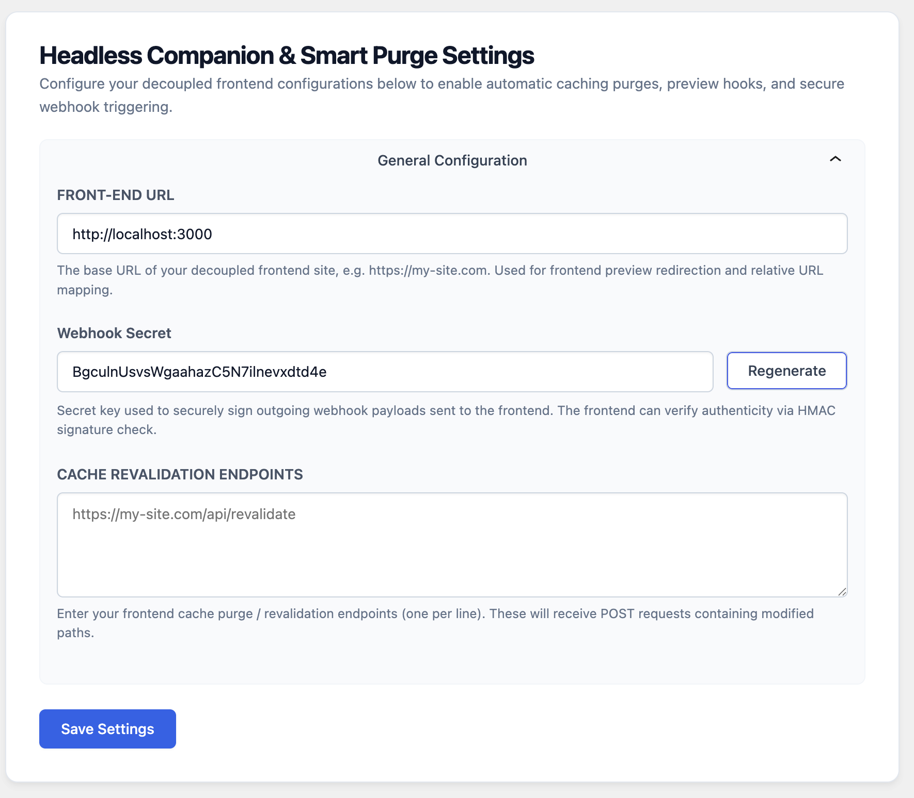
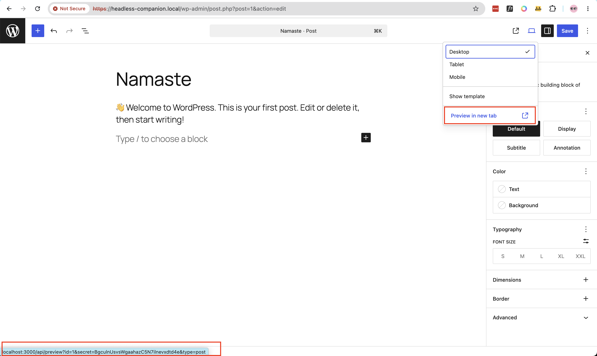
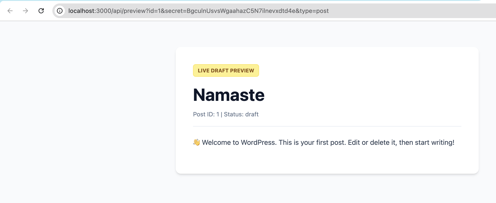
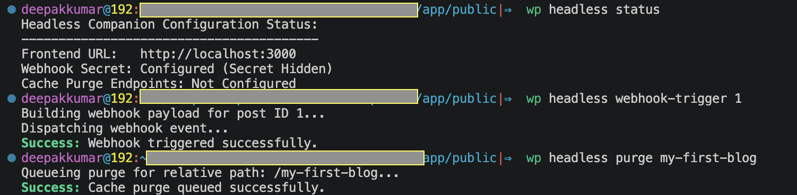

# 📖 Headless Companion & Smart Purge Documentation

Welcome to the documentation for the **Headless Companion & Smart Purge** WordPress plugin. This plugin optimizes the content editing experience for headless (decoupled) websites by offering secure previews, automated webhook-based cache invalidation, and advanced CLI tools.

---

## 📋 Table of Contents
1. [Settings & Dashboard Configuration](#1-settings--dashboard-configuration)
2. [Secure Live Previews](#2-secure-live-previews)
3. [Automated Webhook Dispatch & Smart Purging](#3-automated-webhook-dispatch--smart-purging)
4. [WP-CLI Administration Commands](#4-wp-cli-administration-commands)

---

## 1. Settings & Dashboard Configuration

The React-based settings page allows you to connect WordPress with your decoupled frontend. Go to **Settings > Headless Companion** in the WordPress admin panel to configure the following settings:

*   **Front-end URL:** The root domain of your decoupled site (e.g., `https://my-decoupled-site.com`). Used for preview redirects and path mapping.
*   **Webhook Secret:** A unique cryptographic key used to generate HMAC-SHA256 signatures for outgoing webhooks. Click the **Regenerate** button to instantly generate a secure, 32-character random key.
*   **Cache Revalidation Endpoints:** The URLs on your frontend that will receive POST requests containing modified paths (e.g., `https://my-decoupled-site.com/api/revalidate`), one per line.



---

## 2. Secure Live Previews

When content editors click the **Preview** button in Gutenberg, they need to see a draft version of the post directly on the decoupled frontend. 

### How it Works:
1. The plugin filters the WordPress preview links and redirects editors to your frontend preview api route: 
   ```
   https://my-decoupled-site.com/api/preview?id=[POST_ID]&secret=[PREVIEW_TOKEN]
   ```
2. The `secret` parameter is a temporary, cryptographically secure token that expires shortly after generation.
3. Your frontend makes a secure callback request to the WordPress REST API or WPGraphQL endpoint passing the token in the `Authorization: Bearer [PREVIEW_TOKEN]` header.
4. WordPress authenticates the request and returns the post draft data.





---

## 3. Automated Webhook Dispatch & Smart Purging

When you update or publish posts, pages, or taxonomy terms, the plugin detects these changes and schedules asynchronous background revalidation webhooks.

### Features:
*   **Asynchronous Processing:** Actions are offloaded using Action Scheduler (or fallback WP-Cron) to keep the WordPress editor interface fast and responsive.
*   **Smart Path Mapping:**
    *   **Post Updates:** Purges the post's direct relative path (e.g., `/blog/my-post`) and the homepage (`/`).
    *   **Term/Category Updates:** Purges all corresponding category/term archive pages.
*   **HMAC Payload Signing:** Each webhook includes an `x-hc-signature` header. Your frontend can verify the payload's integrity using the shared Webhook Secret:
    ```javascript
    const computedSignature = crypto
        .createHmac('sha256', secret)
        .update(rawBody)
        .digest('hex');
    ```

---

## 4. WP-CLI Administration Commands

For developers and system administrators, the plugin registers custom commands under the `wp headless` namespace. These can be run from your server terminal:

### Available Commands:
*   **`wp headless status`**  
    Prints the current configuration status, including the configured Front-end URL, Webhook Secret configuration state, and a list of all revalidation endpoints.
*   **`wp headless webhook-trigger <post_id>`**  
    Manually triggers, signs, and dispatches a webhook payload for a specific post. Helpful for troubleshooting revalidation flow issues.
*   **`wp headless purge <path>`**  
    Manually queues a cache purge request for a specific relative route (e.g., `wp headless purge /about`).


